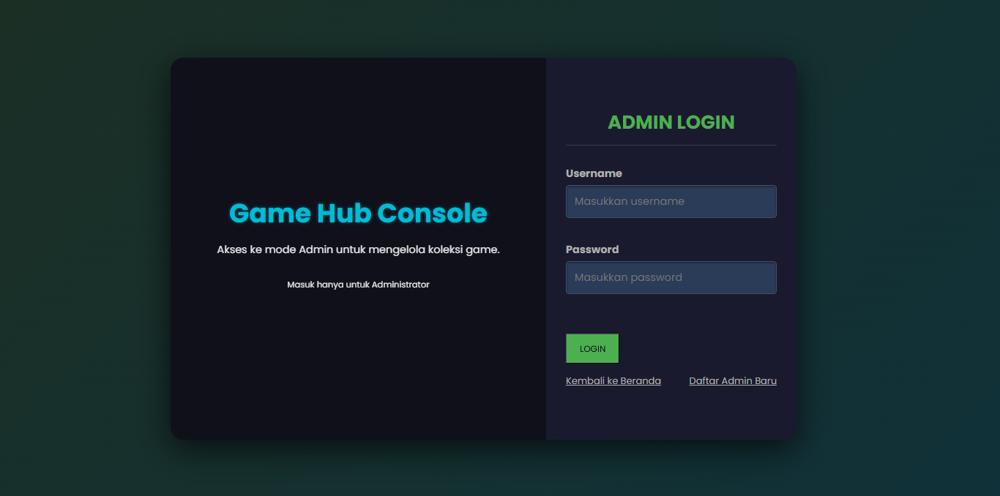

# Game Hub Console

<p align="center">
  
</p>

<p align="center">
  Aplikasi panel admin untuk mengelola koleksi game. Dibuat untuk mempermudah administrator dalam menambah, mengubah, dan menghapus data game.
</p>

<p align="center">
  <a href="#fitur">Fitur</a> •
  <a href="#tampilan-aplikasi">Tampilan Aplikasi</a> •
  <a href="#teknologi-yang-digunakan">Teknologi</a> •
  <a href="#cara-instalasi">Instalasi</a> •
  <a href="#lisensi">Lisensi</a>
</p>

---

## 🚀 Fitur
*   **Autentikasi Admin:** Halaman login khusus untuk administrator.
*   **Manajemen Game:** Tambah, lihat, edit, dan hapus koleksi game.
*   **Pendaftaran Admin Baru:** Fitur untuk mendaftarkan administrator baru.
*   **Dan lain-lain...**

## 📸 Tampilan Aplikasi

Berikut adalah beberapa tangkapan layar dari halaman-halaman yang ada di aplikasi ini.

**Halaman Login**


**Halaman Utama (Dashboard)**


**Halaman Utama (Dashboard)**


**Halaman Utama (Dashboard)**


**Halaman Utama (Dashboard)**


**Halaman Utama (Dashboard)**


**Halaman Utama (Dashboard)**


**Halaman Utama (Dashboard)**


**Halaman Utama (Dashboard)**


**Halaman Utama (Dashboard)**


*(Untuk menambahkan gambar lain, cukup salin-tempel baris di atas dan ganti nama filenya)*

*(**Catatan:** Pastikan nama file gambar seperti `dashboard.png` sesuai dengan nama file yang ada di dalam folder `img` Anda)*

## 💻 Teknologi yang Digunakan

*   **Frontend:** (Contoh: React, Vue, Angular, HTML, CSS)
*   **Backend:** (Contoh: Node.js, Express.js, PHP, Laravel)
*   **Database:** (Contoh: MySQL, PostgreSQL, MongoDB)
*   **Lainnya:** (Contoh: API, Library, dll.)

## ⚙️ Cara Instalasi

Ikuti langkah-langkah berikut untuk menjalankan proyek ini di lingkungan lokal Anda.

1.  **Clone repository ini**
    ```bash
    git clone https://github.com/username-anda/game-hub.git
    ```

2.  **Masuk ke direktori proyek**
    ```bash
    cd game-hub
    ```

3.  **Install dependencies yang dibutuhkan** (sesuaikan dengan package manager Anda)
    ```bash
    npm install
    # atau
    yarn install
    # atau
    composer install
    ```

4.  **Setup file environment**
    Buat file `.env` dari contoh file `.env.example` dan sesuaikan konfigurasinya, terutama untuk koneksi database.
    ```bash
    cp .env.example .env
    ```

5.  **Jalankan aplikasi** (sesuaikan dengan skrip Anda)
    ```bash
    npm run dev
    # atau
    php artisan serve
    ```

6.  Buka browser dan akses `http://localhost:3000` (atau port lain yang sesuai).

## 📄 Lisensi

Proyek ini dilisensikan di bawah Lisensi MIT.

---

Dibuat dengan Akhiles Salvadore Seina Huler - NIM
